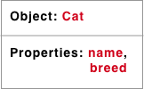
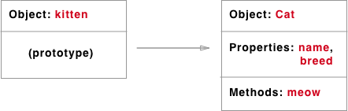

# Prototypal Inheritance

www.mrlamont.com

## About Me

* GA WDI-18 (2015) Alumni
* Entrepreneur & [Consultant](http://massivesoftware.com)
* [Functional Programming Evangelist](https://hackernoon.com/make-the-leap-from-javascript-to-purescript-5b35b1c06fef)

## Objectives

* Demonstrate a use case that explains prototypal inheritance
* Demonstrate what kind of flexibility prototypal inheritance gives programmers

## Javascript is designed on a simple object based paradigm

Virtually everything in Javascript is an object, including strings, arrays, to the browser APIs built on top of JavaScript. Here's a fun fact: even functions in JavaScript are objects, which means they have properties.  You can even create your own objects to encapsulate related functions and variables, using prototypal inheritance.  We're going to learn about prototypical inheritance, but first let's review the characteristics of a JavaScript object

* Objects have properties
* Objects also have a [prototype](https://www.google.com/search?q=define+prototype) object
* JavaScript has a wealth of [Standard built-in objects](https://developer.mozilla.org/en-US/docs/Web/JavaScript/Reference/Global_Objects) (SBO) with methods and properties

## Objects inherit properties and methods from other objects

### Array Example:

* Array properties
  * Array.length
* Array methods
  * join()
  * pop()
  * ...
* Array.prototype property for creating additional properties and methods

## We can create our own objects and inherit from them

### Here's one approach:
1. Make a *Parent* function that "constructs" our object properties
2. Call the *Parent* constructor function with to *new* to create *children*
3. Use the *prototype* function to create methods for the *Parent* function that our children inherit

### Code example explanation

The function *Cat* gives us this:

... which you assign to your kittens using the *new* keyword

... and we can add a prototype function ( e.g., *meow*)

### More ways to create inheritance:
1. [Object.create()](https://developer.mozilla.org/en-US/docs/Web/JavaScript/Reference/Global_Objects/Object/create)
2. [ES6 Classes](https://developer.mozilla.org/en-US/docs/Web/JavaScript/Reference/Classes)

## What's in it for me?
### Leverage standard built-in objects
1. You don't have to create all the prototype methods yourself
2. You can add more methods if they don't exist already ⚠️
3. You can even modify existing prototype methods if they don't match what you want ⚠️

### Prototypal inheritance is a core tenant of Object Oriented Programming
1. Create your own objects that inherit properties and methods from other objects
2. Code reuse and recycling
3. [Encapsulation](https://www.cs.drexel.edu/~introcs/Fa15/notes/06.1_OOP/Advantages.html?CurrentSlide=3)*

## What things should I avoid?
1. Long prototype chains will impact performance
2. Monkey patching (i.e., modifying native prototypes)

## Further Reading
[Code examples](https://github.com/adkelley/prototypal-inheritance)

[Prototypal Inheritance in JavaScript - Kevin Ennis](https://medium.com/@kevincennis/prototypal-inheritance-781bccc97edb)

[Prototypal inheritance - MDN](https://developer.mozilla.org/en-US/docs/Learn/JavaScript/Objects/Inheritance)

[Inheritance and the prototype chain - MDN](https://developer.mozilla.org/en-US/docs/Web/JavaScript/Inheritance_and_the_prototype_chain)

[Four ways to deal with private members in JavaScript](https://eclipsesource.com/blogs/2013/07/05/private-members-in-javascript/)
