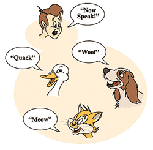
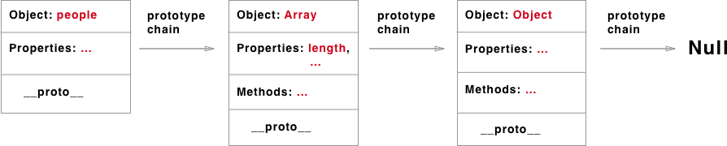
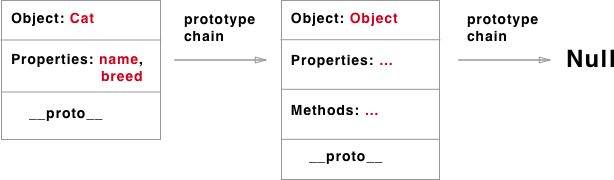
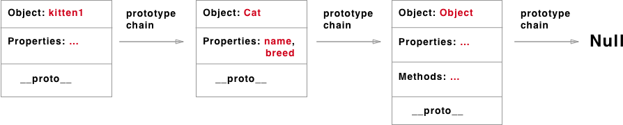
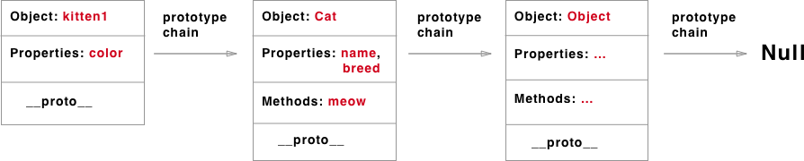

# Prototypal Inheritance in JavaScript

www.mrlamont.com

## Objectives

1. Show how objects in JavaScript can be extended using [prototypal](https://www.google.com/search?q=define+prototype) inheritance
2. Demonstrate the flexibility that prototypal inheritance gives programmers

## Javascript is designed on a simple object based paradigm

Virtually everything in Javascript is an object, including strings, arrays, and even functions! Some exceptions are *primitive values*, such as *null*, *undefined*, and *NaN*. You can even create your own objects to encapsulate related functions and variables, using prototypal inheritance.  

For instance, let's say we have a *user* object with its properties and methods, and want to make *admin* and *guest* as slightly modified variants of it. We’d like to reuse what we have in *user*, not copy/reimplement its methods, just build a new object on top of it. We do this by leveraging JavaScript's prototypal inheritance.

## Objects can inherit properties and methods from other objects

### Array Example:

* Array properties
  * Array.length
* Array methods
  * join()
  * pop()
  * ...
* Use the Array.prototype function to create additional methods

## Create you own prototype objects using Classes (ES6):
[Classes](https://developer.mozilla.org/en-US/docs/Web/JavaScript/Reference/Classes)

### Code example explanation

Our class function *Cat* gives us this:

... which you assign to your kittens using the *new* keyword and individual properties

... and we can add our prototype functions ( e.g., *meow*)

### More ways to create inheritance:
1. [Object.create()](https://developer.mozilla.org/en-US/docs/Web/JavaScript/Reference/Global_Objects/Object/create)
2. [Object Constructors](https://developer.mozilla.org/en-US/docs/Web/JavaScript/Reference/Global_Objects/Object/constructor)

## What's in it for me?
### Leverage properties & methods from standard built-in objects (e.g., Array)
1. You don't have to create all the prototype properties & methods yourself
2. You can add more methods if they don't exist already ⚠️
3. You can even modify existing prototype methods if they don't match what you want ⚠️

### Prototypal inheritance is a core tenant of Object Oriented Programming
1. Create your own objects that inherit properties and methods from other objects
2. Code reuse and recycling
3. [Encapsulation](https://www.cs.drexel.edu/~introcs/Fa15/notes/06.1_OOP/Advantages.html?CurrentSlide=3) [1]

## What things should I avoid?
1. Long prototype chains will impact performance
2. Monkey patching (i.e., modifying native prototypes)

## Further Reading
[My code examples](https://github.com/adkelley/ga-lecture/blob/master/index-FINISHED.html)

[Prototypal Inheritance in JavaScript - Kevin Ennis](https://medium.com/@kevincennis/prototypal-inheritance-781bccc97edb)

[Prototypal inheritance - MDN](https://developer.mozilla.org/en-US/docs/Learn/JavaScript/Objects/Inheritance)

[Inheritance and the prototype chain - MDN](https://developer.mozilla.org/en-US/docs/Web/JavaScript/Inheritance_and_the_prototype_chain)

[1] [Four ways to deal with private members in JavaScript - Tim Buschtöns ](https://eclipsesource.com/blogs/2013/07/05/private-members-in-javascript/)
